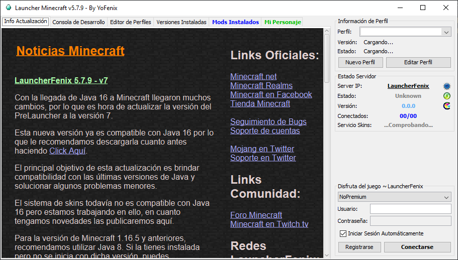
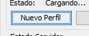

# Suchaland

En este repositorio se encuentra todo lo necesario para poder jugar en el servidor de Suchaland

## Pasos de instalación

1. Clonar o descargar este repositorio
2. Ejecutar el archivo `LauncherFenix.exe` (Tranquilos, no es un virus)
   
    

3. En la seccion de la derecha oprimir el boton "Nuevo Perfil"
   
    

4. Y en argumentos colocar `-Dfml.ignoreInvalidMinecraftCertificates=true -Dfml.ignorePatchDiscrepancies=true`
5. Ejecutar el archivo 
