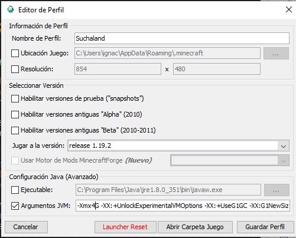
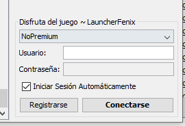
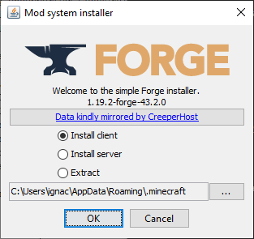
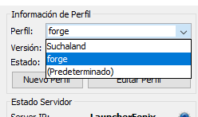

# Suchaland

En este repositorio se encuentra todo lo necesario para poder jugar en el servidor de Suchaland

## Pasos de instalación

1. Clonar o descargar este repositorio
2. Ejecutar el archivo `LauncherFenix.exe` (Tranquilos, no es un virus)
   
    

3. En la seccion de la derecha oprimir el boton "Nuevo Perfil"
   
    

4. Colocal los mismos campos de la imagen

    

    Nombre del perfil: `Suchaland`

    Jugar a la version: `1.19.2`

    Argumentos JVM: `-Xmx4G -XX:+UnlockExperimentalVMOptions -XX:+UseG1GC -XX:G1NewSizePercent=20 -XX:G1ReservePercent=20 -XX:MaxGCPauseMillis=50 -XX:G1HeapRegionSize=32M`

    (Donde en argumentos JVM se puede cambiar el valor de la memoria ram, en este caso se esta usando 4GB, se recomienda un minimo de 4GB) 

    Valores: `-Xmx4G (4GB de RAM) -Xmx6G (6GB de RAM) -Xmx8G (8GB de RAM)`

    
    **⚠⚠⚠⚠⚠ ATENCION: Si no se tiene instalado Java 11, se debe instalar, ya que el launcher no lo instala automaticamente ⚠⚠⚠⚠⚠**

5. Oprimir el boton "Guardar Perfil"

6. Iniciar Sesion con tu cuenta de LauncherFenix o cuenta Premium de Minecraft

    

7. Oprimir el boton "Jugar"

8. Esperar que el juego cargue y cerrarlo

9. Ejecutar el archivo `forge.jar`
    
10. Oprimir el boton `OK` con la seleccion en `Install client`
    
    

11. Esperar a que se instale el forge
12. Ejecutar el archivo `run.bat` como administrador
13. Ejecutar el archivo `LauncherFenix.exe`
14. Seleccionar el perfil nuevo que se creo con nombre forge
    
    

15. Repetir los pasos 6 y 7
    
16. Disfrutar del servidor

Cualquier duda o soporte tecnico via discord: `ナチャス#4128`
